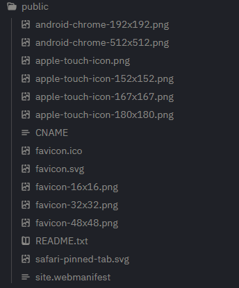
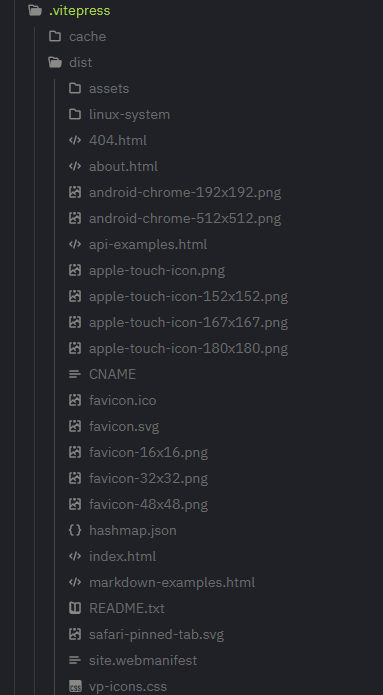
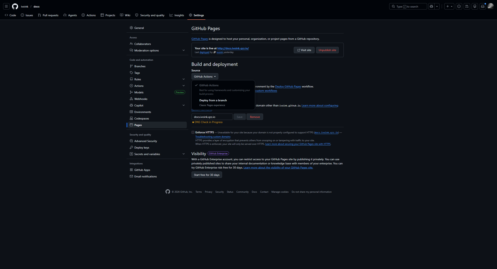

--- 
title: "构建VitePress文档站"
categories: ["零碎随笔"]
tags: ["服务搭建", "随笔"]
date: 2026-04-17
---

## VitePress

`VitePress`是一个由Vue构建的文档网站，相比于`Hexo`和`Hugo`这样的博客，每个主题都有自己独特风格的样式，写法也有很大的差别。`VitePress`的Markdown文档写法简单，也会更注重文档中最重要的文字表达。

## 安装VitePress


点击打开VitePress官网安装介绍


安装`Node.js`后，按照官网提示进行安装与部署配置即可完成网站的搭建

## VitePress配置文件与配置

### 目录结构

安装完成之后进入网站目录，大致是如下的结构


### 配置文件

配置文件位于`/.vitepress/`目录下，配置文件名字是`config.mjs`，页面的配置在里面调整。网站默认语言是中文，调整页面的默认语言也在这个文件中。

### 更换网站默认语言


点击打开vitepress-i18n项目文档


根据这个项目，提示我们先安装一下这个插件

```bash
npm i -D vitepress-i18n
```

在配置文件中更改配置格式，并应用这个插件

这是配置文件默认的样式

```js
import { defineConfig } from "vitepress";

// https://vitepress.dev/reference/site-config
export default defineConfig({
    srcDir: "docs",
    publicDir: ".vitepress/public",
    title: "Inkwell Ops",
    description: "Linux & Infrastructure",
    themeConfig: {
        // https://vitepress.dev/reference/default-theme-config
        nav: [
            { text: "Home", link: "/" },
            { text: "Blog", link: "https://ivoink.qzz.io", target: "_blank" },
        ],

        sidebar: [
            {
                text: "Examples",
                items: [
                    { text: "Markdown Examples", link: "/markdown-examples" },
                    { text: "Runtime API Examples", link: "/api-examples" },
                ],
            },
            {
                text: "Linux",
                base: "/linux-system/",
                items: [{ text: "Overview", link: "/" }],
            },
        ],

        // socialLinks: [
        //     { icon: "github", link: "https://github.com/vuejs/vitepress" },
        // ],
    },
});
```

我们需要改成官网的这种格式

```js
import { withI18n } from 'vitepress-i18n';

const vitePressOptions = {
  title: 'VitePress',
  themeConfig: {
    // ...
  }
};

const vitePressI18nOptions = {
  locales: ['en', 'ko', 'zhHans']
};

export default defineConfig(withI18n(vitePressOptions, vitePressI18nOptions));
```

可以理解成为我们需要将原来在`default`配置里面的放入`vitePressOptions`这个const变量当中

```js
import { defineConfig } from "vitepress";
import { withI18n } from "vitepress-i18n";

// https://vitepress.dev/reference/site-config
const vitePressOptions = {
    srcDir: "docs",
    publicDir: ".vitepress/public",
    title: "Inkwell Ops",
    description: "Linux & Infrastructure",
    themeConfig: {
        // https://vitepress.dev/reference/default-theme-config
        nav: [
            { text: "Home", link: "/" },
            { text: "Blog", link: "https://ivoink.qzz.io", target: "_blank" },
        ],

        sidebar: [
            // {
            //     text: "Examples",
            //     items: [
            //         { text: "Markdown Examples", link: "/markdown-examples" },
            //         { text: "Runtime API Examples", link: "/api-examples" },
            //     ],
            // },
            {
                text: "关于",
                items: [{ text: "关于站点", link: "/about" }],
            },
            {
                text: "Linux",
                base: "/linux-system/",
                items: [
                    { text: "Overview", link: "/" },
                    {
                        text: "01 - Linux 安装与远程登录",
                        link: "/01-linux-installation-and-remote-login",
                    },
                    {
                        text: "02 - 软件与软件源",
                        link: "/02-software-and-software-sources",
                    },
                ],
            },
        ],

        // socialLinks: [
        //     { icon: "github", link: "https://github.com/vuejs/vitepress" },
        // ],
    },
};

const vitePressI18nOptions = {
    locales: ["zhHans"],
};

export default defineConfig(withI18n(vitePressOptions, vitePressI18nOptions));

```

### favicon

这里推荐一个制作favicon的网站


点击跳转Favicon.pub


在其中生成之后的照片几乎有了所有设备需要的格式



我们需要将其放在`public`目录当中，至于怎么确定`public`目录在生成之后里面的文件是否会出现在根目录也十分简单，输入

```bash
npm run docs:build
```

这个时候会在`/.vitepress/`目录下出现一个`dist`目录，里面便是这个博客整个网站目录



我的图片已经出现在根目录当中，我的`public`文件夹在`docs`，也就是文档目录当中

### favicon的配置

参考我的配置的`head`部分

```js
import { defineConfig } from "vitepress";
import { withI18n } from "vitepress-i18n";

// https://vitepress.dev/reference/site-config
const vitePressOptions = {
    srcDir: "docs",
    publicDir: ".vitepress/public",
    head: [
        ["link", { rel: "icon", type: "image/svg+xml", href: "/favicon.svg" }],
        [
            "link",
            {
                rel: "icon",
                type: "image/png",
                sizes: "16x16",
                href: "/favicon-16x16.png",
            },
        ],
        [
            "link",
            {
                rel: "icon",
                type: "image/png",
                sizes: "32x32",
                href: "/favicon-32x32.png",
            },
        ],
        [
            "link",
            {
                rel: "icon",
                type: "image/png",
                sizes: "48x48",
                href: "/favicon-48x48.png",
            },
        ],
        [
            "link",
            {
                rel: "apple-touch-icon",
                sizes: "180x180",
                href: "/apple-touch-icon.png",
            },
        ],
        [
            "link",
            {
                rel: "apple-touch-icon",
                sizes: "152x152",
                href: "/apple-touch-icon-152x152.png",
            },
        ],
        [
            "link",
            {
                rel: "apple-touch-icon",
                sizes: "167x167",
                href: "/apple-touch-icon-167x167.png",
            },
        ],
        ["link", { rel: "manifest", href: "/site.webmanifest" }],
        ["meta", { name: "theme-color", content: "#ffffff" }],
        [
            "meta",
            { name: "msapplication-config", content: "/browserconfig.xml" },
        ],
    ],
    title: "Inkwell Ops",
    description: "Linux & Infrastructure",
    themeConfig: {
        // https://vitepress.dev/reference/default-theme-config
        nav: [
            { text: "Home", link: "/" },
            { text: "Blog", link: "https://ivoink.qzz.io", target: "_blank" },
        ],

        sidebar: [
            // {
            //     text: "Examples",
            //     items: [
            //         { text: "Markdown Examples", link: "/markdown-examples" },
            //         { text: "Runtime API Examples", link: "/api-examples" },
            //     ],
            // },
            {
                text: "关于",
                items: [{ text: "关于站点", link: "/about" }],
            },
            {
                text: "Linux",
                base: "/linux-system/",
                items: [
                    { text: "Overview", link: "/" },
                    {
                        text: "01 - Linux 安装与远程登录",
                        link: "/01-linux-installation-and-remote-login",
                    },
                    {
                        text: "02 - 软件与软件源",
                        link: "/02-software-and-software-sources",
                    },
                ],
            },
        ],

        // socialLinks: [
        //     { icon: "github", link: "https://github.com/vuejs/vitepress" },
        // ],
    },
};

const vitePressI18nOptions = {
    locales: ["zhHans"],
};

export default defineConfig(withI18n(vitePressOptions, vitePressI18nOptions));
```

### 预览

我现在是在我开发机上面搭建并且去编写的，所以我不可能去使用`127.0.0.1`这样的回环地址去预览，这个时候就要去动一下`package.json`这个配置文件，可以看一下`docs:dev`的更改

```json
{
    "devDependencies": {
        "vitepress": "^2.0.0-alpha.17",
        "vitepress-i18n": "^1.3.5"
    },
    "scripts": {
        "docs:dev": "vitepress dev --host 0.0.0.0",
        "docs:build": "vitepress build",
        "docs:preview": "vitepress preview --host 0.0.0.0"
    }
}
```

## 部署

我使用的是GitHub Pages去实现的静态网页，新建目录`/.github/workflow`在里面新建`deploy.yml`文件，直接使用我的就可以

```yml
name: Deploy GitHub Pages

on:
  push:
    branches: [main]
  workflow_dispatch:

permissions:
  contents: read
  pages: write
  id-token: write

concurrency:
  group: pages
  cancel-in-progress: false

jobs:
  build:
    runs-on: ubuntu-latest
    steps:
      - name: Checkout
        uses: actions/checkout@v4
        with:
          fetch-depth: 0

      - name: Setup Node
        uses: actions/setup-node@v4
        with:
          node-version: 20
          cache: npm

      - name: Install dependencies
        run: npm ci

      - name: Build
        run: npm run docs:build

      - name: Upload artifact
        uses: actions/upload-pages-artifact@v3
        with:
          path: .vitepress/dist

  deploy:
    needs: build
    runs-on: ubuntu-latest
    environment:
      name: github-pages
      url: ${{ steps.deployment.outputs.page_url }}
    steps:
      - name: Deploy
        id: deployment
        uses: actions/deploy-pages@v4
```

使用这个工作流，在仓库里面需要做下面这个更改，将Pages的Source改成GitHub Actions即可



**如果有自己的域名，一定要记得写`CNAME`文件在`public`文件夹内**
